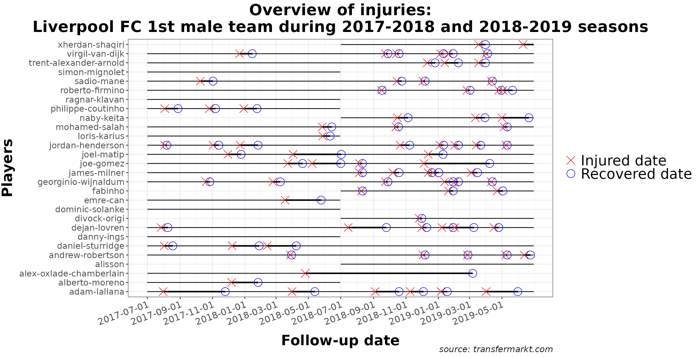
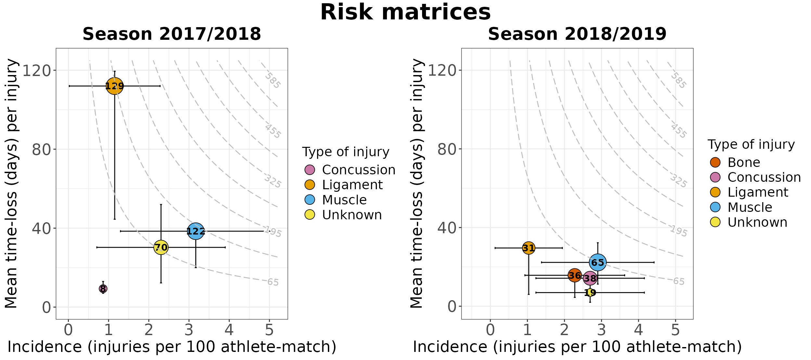
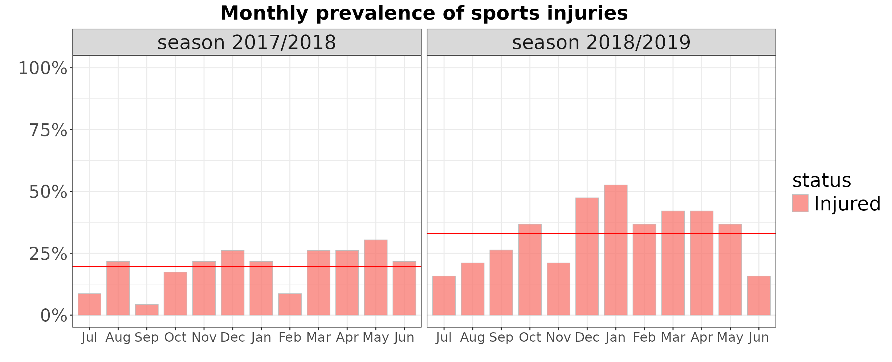

# Visualize Sports Injury Data

``` r
library(injurytools)
library(ggplot2)
library(dplyr)
library(gridExtra)
library(grid)
library(knitr)
```

**Example data**: we continue exploring the cohort of Liverpool Football
Club male’s first team players over two consecutive seasons, 2017-2018
and 2018-2019, scrapped from <https://www.transfermarkt.com/>
website[¹](#fn1).

## A quick glance

``` r
gg_photo(injd, 
         title   = "Overview of injuries:\nLiverpool FC 1st male team during 2017-2018 and 2018-2019 seasons",
         by_date = "2 month", 
         fix     = TRUE) +
  
  ## plus some lines of ggplot2 code..
  xlab("Follow-up date") + ylab("Players") + labs(caption = "source: transfermarkt.com") +
  theme(plot.title = element_text(face = "bold", hjust = 0.5, size = 22),
        axis.text.x.bottom = element_text(size = 13, angle = 20, hjust = 1),
        axis.text.y.left   = element_text(size = 12),
        axis.title.x       = element_text(size = 20, face = "bold", vjust = -1),
        axis.title.y       = element_text(size = 20, face = "bold", vjust = 1.8),
        legend.text        = element_text(size = 20),
        plot.caption       = element_text(face = "italic", size = 12, colour = "gray10"))
```



Let’s count how many injuries (red crosses in the graph) occurred and
how severe they were (length of the thick black line).

``` r
# warnings set to FALSE
df_summary        <- calc_summary(injd) 
df_summary_perinj <- calc_summary(injd, by = "injury_type") 
# injds
```

Code for tidying up the tables

``` r
df_summary |> 
  mutate(incidence_new = paste0(round(incidence, 2), " (", round(incidence_lower, 2), ",", round(incidence_upper, 2), ")"),
         burden_new    = paste0(round(burden, 2), " (", round(burden_lower, 2), ",", round(burden_upper, 2), ")")) |> 
  dplyr::select(2, 7, 1, incidence_new, burden_new) |> 
  kable(col.names = c("N injuries", "N days lost", "Total expo", "Incidence (95% CI)", "Burden (95% CI)"),
        caption   = "Injury incidence and injury burden are reported as 100 player-matches",
        align     = "c")

df_summary_perinj |> 
  mutate(incidence_new = paste0(round(incidence, 2), " (", round(incidence_lower, 2), ",", round(incidence_upper, 2), ")"),
         burden_new    = paste0(round(burden, 2), " (", round(burden_lower, 2), ",", round(burden_upper, 2), ")")) |> 
  dplyr::select(1:2, 9, 4, incidence_new, burden_new) |> 
  kable(col.names = c("Type of injury", "N injuries", "N days lost", "Total expo", "Incidence (95% CI)", "Burden (95% CI)"),
        caption   = "Injury incidence and injury burden are reported as 100 player-matches",
        align     = "c")
```

**Overall**

| N injuries | N days lost | Total expo | Incidence (95% CI) |    Burden (95% CI)    |
|:----------:|:-----------:|:----------:|:------------------:|:---------------------:|
|     82     |    2049     |   74690    | 9.88 (7.74,12.02)  | 246.9 (236.21,257.59) |

Injury incidence and injury burden are reported as 100 player-matches

**Overall per type of injury**

| Type of injury | N injuries | N days lost | Total expo | Incidence (95% CI) |   Burden (95% CI)   |
|:--------------:|:----------:|:-----------:|:----------:|:------------------:|:-------------------:|
|      Bone      |     11     |     173     |   74690    |  1.33 (0.54,2.11)  | 20.85 (17.74,23.95) |
|   Concussion   |     16     |     213     |   74690    |  1.93 (0.98,2.87)  | 25.67 (22.22,29.11) |
|    Ligament    |     9      |     596     |   74690    |  1.08 (0.38,1.79)  | 71.82 (66.05,77.58) |
|     Muscle     |     25     |     735     |   74690    |  3.01 (1.83,4.19)  | 88.57 (82.16,94.97) |
|    Unknown     |     21     |     332     |   74690    |  2.53 (1.45,3.61)  | 40.01 (35.7,44.31)  |

Injury incidence and injury burden are reported as 100 player-matches

Let’s plot the information shown in the second table in a risk matrix
that displays injury incidence against injury burden.

``` r
# warnings set to FALSE
gg_riskmatrix(injd, 
              by = "injury_type", 
              title = "Risk matrix")
```

Code for further plot specifications

``` r
# warnings set to FALSE
palette <- c("#000000", Ligament = "#E69F00", Muscle = "#56B4E9", "#009E73",
             Unknown = "#F0E442", "#0072B2", Bone = "#D55E00", Concussion = "#CC79A7")
# source of the palette: http://www.cookbook-r.com/Graphs/Colors_(ggplot2)/
theme3 <- theme(plot.title = element_text(face = "bold", hjust = 0.5, size = 20),
                axis.text.x.bottom = element_text(size = 20),
                axis.text.y.left = element_text(size = 20),
                axis.title.x = element_text(size = 15),
                axis.title.y = element_text(size = 15),
                legend.title = element_text(size = 15),
                legend.text = element_text(size = 15))

gg_riskmatrix(injd, 
              by = "injury_type", 
              title = "Risk matrix") +
  scale_fill_manual(name = "Type of injury",
                    values = palette) +
  guides(fill = guide_legend(override.aes = list(size = 5))) +
  theme3
```

    #> `height` was translated to `width`.


  

## Comparing injuries occurred in 17/18 vs. 18/19

We prepare two `injd` objects:

``` r
# warnings set to FALSE
injd1 <- cut_injd(injd, datef = 2017)
injd2 <- cut_injd(injd, date0 = 2018)
```

``` r
## Plot just for checking whether cut_injd() worked well
p1 <- gg_photo(injd1, fix = TRUE, by_date = "3 months")
p2 <- gg_photo(injd2, fix = TRUE, by_date = "3 months")
grid.arrange(p1, p2, ncol = 2)
```


Let’s compute injury summary statistics for each season.

``` r
# warnings set to FALSE
df_summary1 <- calc_summary(injd1, quiet = T)
df_summary2 <- calc_summary(injd2, quiet = T)
```

Code for tidying up the tables

``` r
## **Season 2017/2018**
df_summary1 |> 
  mutate(incidence_new = paste0(round(incidence, 2), " (", round(incidence_lower, 2), ",", round(incidence_upper, 2), ")"),
         burden_new    = paste0(round(burden, 2), " (", round(burden_lower, 2), ",", round(burden_upper, 2), ")")) |> 
  dplyr::select(2, 7, 1, incidence_new, burden_new) |> 
  kable(col.names = c("N injuries", "N days lost", "Total expo", "Incidence (95% CI)", "Burden (95% CI)"),
        caption   = "Injury incidence and injury burden are reported as 100 player-matches",
        align     = "c")

## **Season 2018/2019**
df_summary2 |> 
  mutate(incidence_new = paste0(round(incidence, 2), "  (", round(incidence_lower, 2), ",", round(incidence_upper, 2), ")"),
         burden_new    = paste0(round(burden, 2), "  (", round(burden_lower, 2), ",", round(burden_upper, 2), ")")) |> 
  dplyr::select(2, 7, 1, incidence_new, burden_new) |> 
  kable(col.names = c("N injuries", "N days lost", "Total expo", "Incidence (95% CI)", "Burden (95% CI)"),
        caption   = "Injury incidence and injury burden are reported as 100 player-matches",
        align     = "c")
```

**Season 2017/2018**

| N injuries | N days lost | Total expo | Incidence (95% CI) |    Burden (95% CI)     |
|:----------:|:-----------:|:----------:|:------------------:|:----------------------:|
|     26     |    1141     |   31247    | 7.49 (4.61,10.37)  | 328.64 (309.57,347.71) |

Injury incidence and injury burden are reported as 100 player-matches

**Season 2018/2019**

| N injuries | N days lost | Total expo | Incidence (95% CI) |    Burden (95% CI)     |
|:----------:|:-----------:|:----------:|:------------------:|:----------------------:|
|     56     |     908     |   43443    | 11.6 (8.56,14.64)  | 188.11 (175.87,200.34) |

Injury incidence and injury burden are reported as 100 player-matches

  

### - Who were the most injured players? And the most severely affected?

Player-wise statistics can be computed by
`df_summay1_pl <- calc_summary(injd1, overall = FALSE)`. Then, we plot
them:

``` r
p11 <- gg_rank(injd1, line_overall = TRUE)
p12 <- gg_rank(injd1, summary_stat = "burden", line_overall = TRUE)
p21 <- gg_rank(injd2, line_overall = TRUE)
p22 <- gg_rank(injd2, summary_stat = "burden", line_overall = TRUE) 

# grid.arrange(p11, p21, p12, p22, nrow = 2)
```

Code for further plot specifications

``` r
theme2 <- theme(plot.title = element_text(face = "bold", hjust = 0.5, size = 26),
                axis.text.x.bottom = element_text(size = 18),
                axis.text.y.left = element_text(size = 13),
                axis.title.x = element_text(size = 11, vjust = 1),
                axis.title.y = element_text(size = 22, face = "bold", vjust = 1))

p11 <- p11 + 
  xlab("Injury incidence") + 
  ylab("Player-wise incidence (injuries per 100 player-match)") +
  ggtitle("2017/2018 season") +
  scale_y_continuous(limits = c(0, 80)) + ## same x axis 
  theme2 +
  theme(plot.margin = margin(0.2, 0.2, 0.2, 0.5, "cm"))
p12 <- p12 +
  xlab("Injury burden") + 
  ylab("Player-wise burden (days lost per 100 player-match)") +
  scale_y_continuous(limits = c(0, 6110)) + 
  theme2 +
  theme(plot.margin = margin(0.2, 0.2, 0.2, 0.65, "cm"))

p21 <- p21 + 
  ylab("Player-wise incidence (injuries per 100 player-match)") +
  ggtitle("2018/2019 season") +
  scale_y_continuous(limits = c(0, 80)) + 
  theme2 
p22 <- p22 +
  ylab("Player-wise burden (days lost per 100 player-match)") +
  scale_y_continuous(limits = c(0, 6110)) + 
  theme2

grid.arrange(p11, p21, p12, p22, nrow = 2)
```


  

### - Which injuries were more frequent? And more burdensome?

``` r
# warnings set to FALSE
p1 <- gg_riskmatrix(injd1, by = "injury_type", 
                    title = "Season 2017/2018", add_contour = FALSE)
p2 <- gg_riskmatrix(injd2, by = "injury_type",
                    title = "Season 2018/2019", add_contour = FALSE)

# Print both plots side by side
# grid.arrange(p1, p2, nrow = 1)
```

Code for further plot specifications

``` r
palette <- c("#000000", Ligament = "#E69F00", Muscle = "#56B4E9", "#009E73",
             Unknown = "#F0E442", "#0072B2", Bone = "#D55E00", Concussion = "#CC79A7")
# source of the palette: http://www.cookbook-r.com/Graphs/Colors_(ggplot2)/
theme3 <- theme(plot.title = element_text(face = "bold", hjust = 0.5, size = 20),
                axis.text.x.bottom = element_text(size = 18),
                axis.text.y.left = element_text(size = 18),
                axis.title.x = element_text(size = 18),
                axis.title.y = element_text(size = 18),
                legend.title = element_text(size = 15),
                legend.text = element_text(size = 15))

## Plot
p1 <- gg_riskmatrix(injd1, by = "injury_type", 
                    title = "Season 2017/2018", add_contour = T,
                    cont_max_x = 5.2, cont_max_y = 125, ## after checking the data
                    bins = 10) 
p2 <- gg_riskmatrix(injd2, by = "injury_type",
                    title = "Season 2018/2019", add_contour = T, 
                    cont_max_x = 5.2, cont_max_y = 125,
                    bins = 10)

p1 <- p1 +
  scale_x_continuous(limits = c(-0.05, 5.2)) +
  scale_y_continuous(limits = c(-0.05, 125)) + 
  scale_fill_manual(name = "Type of injury",
                    values = palette) + 
  guides(fill = guide_legend(override.aes = list(size = 5))) +
  theme3
p2 <- p2 +
  scale_x_continuous(limits = c(-0.5, 5.2)) +
  scale_y_continuous(limits = c(-0.5, 125)) + 
  scale_fill_manual(name = "Type of injury",
                    values = palette) + # keep the same color coding
  guides(fill = guide_legend(override.aes = list(size = 5))) +
  theme3

grid.arrange(p1, p2, ncol = 2, 
             top = textGrob("Risk matrices", gp = gpar(fontsize = 26, font = 2))) ## for the main title
```



  

### - How many players were injured in each month?

We will create bar plots, with each bar representing the monthly
prevalence[²](#fn2).

``` r
gg_prevalence(injd, time_period = "monthly",
              line_mean = TRUE)
```

Code for further plot specifications

``` r
theme4 <- theme(plot.title = element_text(face = "bold", hjust = 0.5, size = 20),
                axis.text.x = element_text(size = 13.5),
                axis.text.y = element_text(size = 18),
                legend.title = element_text(size = 20),
                legend.text = element_text(size = 20),
                strip.text = element_text(size = 20))


gg_prevalence(injd, time_period = "monthly",
              line_mean = TRUE,
              title = "Monthly prevalence of sports injuries") + 
  theme4
```



``` r
gg_prevalence(injd, time_period = "monthly",
              by = "injury_type", line_mean = TRUE)
```

Code for further plot specifications

``` r
palette2 <- c("seagreen3", "#000000", Ligament = "#E69F00", Muscle = "#56B4E9", "#009E73",
              Unknown = "#F0E442", "#0072B2", Bone = "#D55E00", Concussion = "#CC79A7")
# source of the palette: http://www.cookbook-r.com/Graphs/Colors_(ggplot2)/


gg_prevalence(injd, time_period = "monthly", 
              by = "injury_type", line_mean = TRUE,
              title = "Monthly prevalence of each type of sports injuries") +
  scale_fill_manual(name = "Type of injury", 
                    values = palette2) + 
  theme4
```


------------------------------------------------------------------------

1.  These data sets are provided for illustrative purposes. We warn that
    they might not be accurate and could potentially include
    discrepancies or incomplete information compared to what actually
    occurred.

2.  See the *Note* section in `?calc_prevalence()` or have a look at
    this section in [Estimate summary
    statistics](https://lzumeta.github.io/injurytools/articles/estimate-epi-measures.html#calc_prevalence)
    vignette, to better understand what the proportions refer to.
