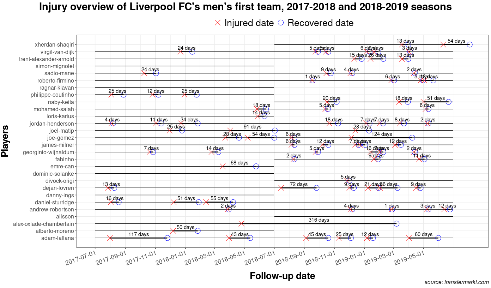

# injurytools

## Overview

**`injurytools`** is a package designed for the field of Sports
Medicine. It simplifies the data analysis workflow by providing
convenience functions and handy tools for sports injury and illness
data.

The functions can be classified into: (a) sports injury and illness data
preparation, (b) descriptive analyses and (c) data visualization
routines. Further analyses, such as the estimation of the risk of
injury/illness (any sports-related health problem) with other covariate
effects, can be performed outside of **`injurytools`**, whether the
event of health problem is viewed as count or time-to-event data.

To get an overview of the package, see the
[Articles](https://lzumeta.github.io/injurytools/articles/) section.

In practice, the package can automate specific descriptive reports that
are routinely generated for sports injury and illness surveillance.

## Installation

To install from [CRAN](https://CRAN.R-project.org):

``` r
install.packages("injurytools")
```

To install the most current version from GitHub:

``` r
devtools::install_github("lzumeta/injurytools")
```

## Usage

Functions for data preparation start with `prepare_*()`, those for
estimating epidemiological measures start with `calc_*()`, and those for
data visualization with `gg_*()`.

The below outlines at a glance how **`injurytools`** can help to get a
comprehensive picture of sports injury and illness data:

``` r
library(injurytools)
library(ggplot2)

(p <- gg_photo(injd, 
               title   = "Injury overview of Liverpool FC's men's first team, 2017-2018 and 2018-2019 seasons",
               by_date = "2 month") +
    ## plus some lines of ggplot2 code..
    xlab("Follow-up date") + ylab("Players") + 
    labs(caption = "source: transfermarkt.com") +
    theme(axis.text.x.bottom = element_text(size = 13, angle = 20, hjust = 1),
          axis.text.y.left   = element_text(size = 12),
          axis.title.x = element_text(size = 20, face = "bold", vjust = -1),
          axis.title.y = element_text(size = 20, face = "bold", vjust = 1.8),
          legend.text  = element_text(size = 20),
          legend.position = "top",
          plot.caption = element_text(face = "italic", size = 12, colour = "gray10"),
          plot.title = element_text(face = "bold", hjust = 0.5, size = 22),
          plot.title.position = "plot")
)
```


``` r
p +
  ## add days lost info
  geom_text(aes(x = date_injured + days_lost/2, y = person_id, label = paste0(days_lost, " days")), 
            vjust = -0.5, data = injd) +
  scale_y_discrete(expand = expansion(mult = 0.05))
```



``` r
p + 
  ## add injury info
  geom_text(aes(x = date_injured + days_lost/2, y = person_id, label = injury),
            vjust = -0.5, data = injd) +
  scale_y_discrete(expand = expansion(mult = 0.05))
```


## How to contribute

If you have problems with the package, find any bugs, or have
suggestions for improvements, please feel free to open a [GitHub
issue](https://github.com/lzumeta/injurytools/issues) or touch us
directly via email. We also welcome your feedback.
