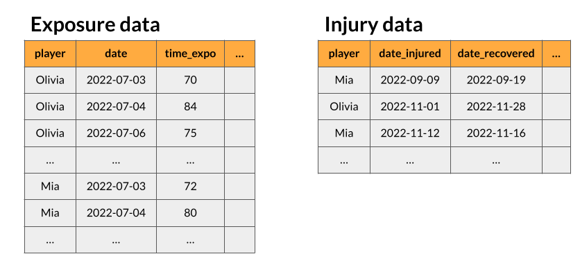

```{r, include = FALSE}
library(knitr)
knitr::opts_chunk$set(
  collapse = TRUE,
  comment = "#>"
)
## to fold/hook the code
hook_output <- knit_hooks$get("output")
knit_hooks$set(output = function(x, options) {
   lines <- options$output.lines
   if (is.null(lines)) {
     return(hook_output(x, options))  # pass to default hook
   }
   x <- unlist(strsplit(x, "\n"))
   more <- "..."
   if (length(lines) == 1) {
     if (length(x) > lines) {
       # truncate the output, but add ....
       x <- c(head(x, lines), more)
     }
   } else {
     x <- c(if (abs(lines[1]) > 1) more else NULL,
            x[lines],
            if (length(x) > lines[abs(length(lines))]) more else NULL
           )
   }
   # paste these lines together
   x <- paste(c(x, ""), collapse = "\n")
   hook_output(x, options)
 })
```

```{r setup, warning = F, message = F}
library(injurytools)
library(dplyr)
```

Data preprocessing is the very first step one has to follow, every time one wants to analyze sports injury data using `injurytools` **R** package.

This document briefly shows how to use the functions that are intended to facilitate this data preprocessing step and how the final data set is like.

# Starting point

Data can be collected in several ways and by several means. A conventional manner is to collect data as events occur, and with this respect it is common, in the field of sports medicine, to store injury records on one hand, and data related to training and competitions/matches (*exposure time* among others) in a separate table, on the other hand. That is, we consider that the user has the raw data in two separate data sets that we call **injury** and **exposure data**, respectively^[If the data is not recorded this way, we suggest spliting both information into separate tables and then following the same functions provided by the package.].

<!--  -->



# 1) prepare and standardize injury and exposure data 

Thus the early task is to tidy up these two sources of data.

As example data sets we consider [`raw_df_injuries`](https://lzumeta.github.io/injurytools/reference/raw_df_injuries.html) and [`raw_df_exposures`](https://lzumeta.github.io/injurytools/reference/raw_df_exposures.html) data sets available from the `injurytools` package. These are data of Liverpool Football Club male's first team players over two consecutive seasons, 2017-2018 and 2018-2019, scrapped from https://www.transfermarkt.com/ website:

```{r}
head(raw_df_injuries)
head(raw_df_exposures)
```

We standardize the key column names such as player (subject) identifier, dates of injury and recovery (if any), training/match/season date and amount of time of exposure and set them proper formats by means of `prepare_inj()` and `prepare_exp()`[^prepare-note-1].

[^prepare-note-1]: The `date` argument should be either of class *Date*, given in "%Y-%m-%d" format, or of class *integer*/*numeric*, a 4-digit integer referring to year in which the season started.  

```{r}
df_injuries <- prepare_inj(df_injuries0   = raw_df_injuries,
                           player         = "player_name",
                           date_injured   = "from",
                           date_recovered = "until")
```


```{r}
df_exposures <- prepare_exp(df_exposures0 = raw_df_exposures,
                            player        = "player_name",
                            date          = "year",
                            time_expo     = "minutes_played")
```

We suggest collecting exposure time on as fine scale as possible, i.e. **minutes** would be the desired unit as the total time spent training and participating in competitions/matches. However, if the units are "seasons" then do:

<details>

<summary>
  See the R-code 
</summary>

```{r}
## a possible way for the case that each row in exposure data correspond to a
## season and there is nor more information about time of exposure
raw_df_exposures$time_expo_aux <- 1 
df_exposures2 <- prepare_exp(df_exposures0 = raw_df_exposures,
                             player        = "player_name",
                             date          = "year",
                             time_expo     = "time_expo_aux")
injd <-  prepare_all(data_exposures = df_exposures2,
                     data_injuries  = df_injuries,
                     exp_unit = "seasons")
head(injd)
```
</details>

# 2) integrate both sources of data

Then, we apply `prepare_all()` to the data sets tidied up above. It is important to specify the unit of exposure, `exp_unit` argument, that must be one of "minutes", "hours", "days", "matches_num", "matches_minutes", or "activity_days", "seasons".

```{r}
injd <-  prepare_all(data_exposures = df_exposures,
                    data_injuries  = df_injuries,
                    exp_unit = "matches_minutes")
head(injd)
# injd %>% 
#   group_by(player) %>% 
#   slice(1, n())
```

The outcome is a prepared data set, structured in an suitable way that is ready for its use by statistical modelling approaches. This data set will always have the columns listed below (standardized columns or created by the function), as well as further (optional) sports related variables.

* `player`: player identifier.

* `t0` and `tf`: the follow-up period of the corresponding player, i.e. player's first and last dates observed (same value for each `player`).

* `date_injured` and `date_recovered`: dates of injury and recovery of the corresponding observation (if any; otherwise `NA`).

* `tstart` and `tstop`: beginning and ending dates of the corresponding interval in which the observation has been at risk of injury.

* `tstart_x`and `tstop_x`: beginning and ending times of the corresponding interval in which the observation has been at risk of injury (it depends on the unit of exposure time specified).

* `status`: injury (event) indicator.

* `enum`: an integer indicating the recurrence number, i.e. the $k$-th injury (event), at which the observation is at risk.

* `days_lost`: number of days lost due to injury occured at `tstop`/`date_injured` (if any; otherwise 0), i.e. `date_recovered` - `date_injured` in days.

For example the first row of `injd` corresponds to the player Adam Lallana to the risk set that starts in 2017-07-01 and ends at 2017-07-31, after having played 236 minutes, when he got firstly (`enum` = 1) injured (`status` = 1). The second row corresponds to the risk set of being injured by a second injury (`enum` = 2), starts when he was fully recovered in 2017-11-23 and finshes when he suffered another hamstring injury^[The fact that `tstart` equals `tstop` is due to the player did not participate and had no minutes playing a match in that period of time. Note that this will cause problems if one wants to use survival analysis techniques. Possible alternatives: use another exposure time unit, or add a small number of minutes (e.g. 0.5)...].  

# The prepared data set, an `injd` object

This final data set it's an **R** object of class `injd`,

```{r}
class(injd)
```
 
and have the following attributes:

```{r}
str(injd, 1)
```

* `unit_exposure`: a character indicating the unit of exposure time used in this object.

* `follow_up`: a data frame consisting of one row per player with their first and last dates observed (`t0` and `tf` columns).

* `data_exposures`: the preprocessed exposure data frame.

* `data_injuries`: the preprocessed injury data frame.

* `data_injuries_long`: `data_injuries` data frame in long format in which each row corresponds to player-event_type.

To extract one of the attributes, for example `unit_exposure`, type:

```{r}
attr(injd, "unit_exposure")
```

